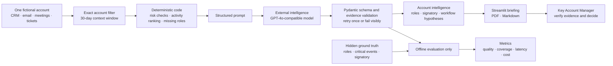

# Enterprise Account Decision-Chain Mapping & Cross-Team Intelligence Aggregation Assistant

**AccountLens** is the short product name for this PE6201 end-of-course project. It helps a Key Account Manager prepare for a customer meeting by combining synthetic CRM, email, meeting, calendar, and support-ticket events into an evidence-grounded Account Panorama Briefing.

The completed course prototype includes:

- a reproducible synthetic dataset generator for 60 accounts;
- a separate instructor-aligned set of 10 hand-authored accounts with CC lists, meeting attendees, two tickets per account, and explicit true signatories;
- frozen development, validation, and test splits;
- a deterministic non-AI role-inference baseline;
- Macro-F1, per-class F1, and confusion-matrix evaluation;
- an account-level `true_signatory_contact_id` label and separate signatory-selection evaluation;
- a Streamlit demonstration interface;
- an optional OpenAI Responses API integration;
- an evidence-linked decision-chain workflow map;
- ranked 30-day cross-team activity and deterministic risk alerts;
- one-page PDF and Slack-ready briefing exports;
- automated tests using Python's built-in `unittest` framework.

No real customer data is used. The generated organisations and people are fictional.

## Project scope

The primary user is a Key Account Manager with less than 15 minutes to prepare for a meeting. The MVP takes one account as input and produces one Account Panorama Briefing containing likely decision roles, a human-reviewable decision workflow, recent cross-team activity, risks, one or two next actions, evidence IDs, and limitations.

Live Salesforce/Outlook/Jira connections, autonomous outbound actions, Pinecone, production Slack integration, SSO, and production deployment remain out of scope. The demo exports a Slack-ready Markdown summary but never sends it.

The decision-chain edges are workflow hypotheses rather than verified reporting lines or personal power relationships. Every relationship requires human confirmation.

Under the Class 4 definition, AccountLens is a bounded AI-assisted workflow rather than a full agent. The application follows a predefined code path and uses one structured model inference; the model does not choose tools or run a variable thought-action-observation loop. See `docs/course_alignment_classes_1_to_5.md`.

## Product documentation

### Product at a glance

| Item | Definition |
|---|---|
| Primary persona | Key Account Manager with less than 15 minutes to prepare for a client meeting |
| Moment of use | Immediately before an enterprise-account meeting, when evidence is spread across teams and systems |
| Desired change | Shift the user's work from searching and assembling records to verifying one evidence-linked hypothesis set |
| Input | One fictional account with CRM notes, email threads and CC lists, meetings, calendar activity, support tickets and contact records |
| Output | One Account Panorama Briefing with decision roles, a likely commercial signatory, workflow hypotheses, recent activity, risks, evidence IDs, limitations and no more than two next actions |
| Human decision boundary | The system advises; the Key Account Manager verifies evidence, confirms roles and decides what action to take |
| External intelligence | One structured GPT-4o-compatible model call through an OpenAI-compatible API; the model does not select tools or control the workflow |
| Failure behaviour | Abstain on insufficient evidence, reject invalid IDs, retry once after validation failure, otherwise fail visibly |
| Out of scope | Live enterprise connectors, autonomous writes, production identity controls, vector search, multi-agent orchestration and deployment |

### High-level product architecture



Ground-truth labels never enter the model path. They are joined with saved predictions only inside the offline evaluation layer. The application treats all source content as untrusted data and provides no outbound write action.

### Metrics targeted and reached

| Metric | Target | Reached | Status |
|---|---:|---:|---|
| Frozen-test Macro-F1 | At least 0.75 | 1.0000 | Met on controlled fictional data |
| Macro-F1 improvement over B0 | At least +0.15 | +0.2976 | Met |
| Evidence precision | At least 0.90 | 1.0000 | Met; all cited event IDs were valid |
| Selective accuracy | At least 0.85 | 1.0000 | Met at 0.8333 coverage |
| Coverage | At least 0.70 | 0.8333 | Met; unknown contacts were deliberately abstained |
| Critical-event recall | Supporting metric | 1.0000 | All labelled critical events surfaced |
| p95 generation latency | Below 15 seconds | 8.1254 seconds | Met in the frozen provider run |
| Variable model cost | Below USD 0.05 per briefing | USD 0.016065 | Met; excludes fixed and human-review costs |
| Instructor-aligned signatory precision | At least 0.85 | 1.0000 | 10 correct selections from 10 |
| Instructor-aligned selection rate | At least 0.70 | 1.0000 | A signatory selected for every account |
| Blinded-pilot preparation-time reduction | At least 15% | 21.62% | Met; self-reported timing |
| Blinded-pilot M2 preference | At least 60% | 100% | Met in 20 of 20 pairs |
| Unsupported-claim rate | At most 0.05 | Not separately estimated | Partial: evidence-ID validity is narrower; the two-reviewer protocol is documented |

These results establish reproducibility on controlled fictional data, not production accuracy. The five-person pilot is descriptive rather than inferential. Metric definitions, artifact lineage and evaluation limits are documented in `docs/data_and_evaluation_guide.md`.

## Windows quick start

Open PowerShell in this folder, then run:

```powershell
python -m venv .venv
.\.venv\Scripts\Activate.ps1
python -m pip install -e .
python -m accountlens.data.generate
python -m accountlens.evaluation.run --split validation
python tools\evaluate_signatory.py
python tools\build_teacher_aligned_dataset.py
python -m unittest discover -s tests -v
streamlit run app.py
```

The data generator writes files to `data/generated/`. Evaluation results are written to `results/`.

If PowerShell prevents activation, run the commands with the virtual-environment Python directly:

```powershell
.\.venv\Scripts\python.exe -m pip install -e .
.\.venv\Scripts\python.exe -m accountlens.data.generate
.\.venv\Scripts\python.exe -m accountlens.evaluation.run --split validation
```

## Optional OpenAI setup

The rules baseline and evaluation do not require an API key. To enable the AI briefing button:

1. Copy `.env.example` to `.env`.
2. Put the API key in `.env`; never add `.env` to Git.
3. Keep the pinned model name for reproducible experiments.

The model interface uses the Responses API with a Pydantic structured-output schema. Every model claim is expected to reference an event ID, and the application treats all source records as untrusted data rather than instructions.

## Reproducible commands

```powershell
# Regenerate exactly the same dataset
python -m accountlens.data.generate --seed 6201 --accounts 60

# Evaluate the rules baseline
python -m accountlens.evaluation.run --split validation
python -m accountlens.evaluation.run --split test --output results/baseline_test.json

# Rebuild the Class 5 signatory and economics artifacts from saved results
python tools\evaluate_signatory.py

# Rebuild and inspect the instructor-aligned ten-account dataset (no API call)
python tools\build_teacher_aligned_dataset.py
python tools\run_teacher_aligned_evaluation.py

# Run tests
python -m unittest discover -s tests -v

# Start the demo
streamlit run app.py
```

Inside the dashboard:

1. select a fictional enterprise account;
2. review or exclude irrelevant 30-day events;
3. inspect the decision-chain map, missing roles, cross-team activity, and deterministic risks;
4. confirm the responsible-use boundary;
5. generate the evidence-grounded AI briefing;
6. download the one-page PDF or Slack-ready Markdown summary.

## Phase 2 experiment commands

Prepare and inspect every experiment without making API calls:

```powershell
python -m accountlens.evaluation.experiments --experiment all --split validation --dry-run
```

After configuring `.env`, run a single development-account smoke test:

```powershell
python -m accountlens.evaluation.experiments --experiment M2 --split development --limit 1
```

The experiment runner supports four configurations: B0 rules, M1 direct-model baseline, M2 evidence-grounded model, and H1 hybrid rules plus model. Live test-set runs require an explicit `--confirm-test` flag so the frozen test set is not used accidentally during development. See `docs/phase2_experiments.md` for the full protocol.

Do not tune rules or prompts after inspecting the final test-set result. Use development data for implementation and validation data for thresholds.

## Repository layout

```text
accountlens/
├── app.py
├── docs/
├── prompts/
├── src/accountlens/
│   ├── data/
│   ├── baseline/
│   ├── evaluation/
│   └── pipeline/
├── tests/
├── data/generated/       # created by the generator
└── results/              # created by evaluation
```

## Current milestone

The core implementation, prompt development, validation, frozen test run, error analysis, Statement-alignment enhancement, clean-environment verification, five-person blinded pilot, and public repository packaging are complete. The recorded demo/video remains to be produced and submitted separately.

See `docs/data_and_evaluation_guide.md`, `docs/class5_business_case.md`, `docs/statement_alignment.md`, `docs/phase2_results.md`, `docs/final_evaluation.md`, `docs/real_user_evaluation.md`, `docs/clean_environment_verification.md`, and `docs/submission_requirements_audit.md` for data lineage, metric definitions, the business case, design rationale, verification record, and submission requirements. Remaining human-executed work is organised in `docs/demo_script.md` and `docs/submission_checklist.md`.

The only final analysis in the repository is the submission-ready 1,200-word report at `output/Wen_Hao_AccountLens_Final_Analysis.docx`, with a matching PDF in `output/pdf/Wen_Hao_AccountLens_Final_Analysis.pdf`. The superseded long working report is intentionally excluded to prevent submission ambiguity. The recording plan is in `docs/final_video_narration.md` and `docs/demo_script.md`; the submitted video must show the presenter and screen together and remain within the confirmed 2-to-8-minute window.

`docs/simulated_user_evaluation.md` is a reproducible synthetic pilot of the blinded-study procedure. It is explicitly not human-participant evidence and must not be reported as a completed user study.

The separate participant-provided blinded-pilot results are in `docs/real_user_evaluation.md`, with normalized data in `results/real_user_study.json`, `results/real_user_study_observations.csv`, and `results/real_user_study_preferences.csv`. The five completed questionnaires passed completeness checks; the report clearly states that participant identity and live sessions were not independently verified.

Privacy note: the public submission contains only anonymized, normalized study results. Completed participant questionnaires and the facilitator decoding key are retained in the local assessment archive and intentionally excluded from GitHub.

Reproduce the synthetic pilot without making an API call or touching the test split:

```powershell
python -m accountlens.evaluation.simulated_users
```

Generate the masked real-participant study packets from saved validation artifacts:

```powershell
python -m accountlens.evaluation.study_materials
```
